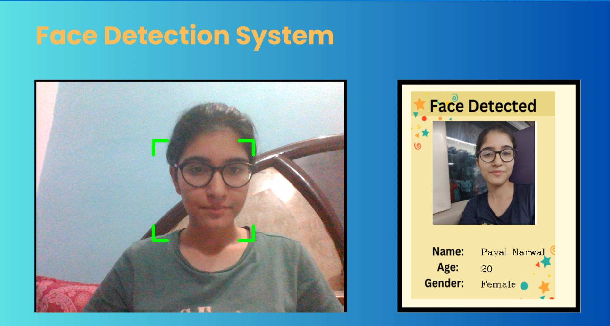

# Face-Detection-System
 
# Introduction

The Face Detection System is a Python application that utilizes computer vision and deep learning techniques to detect faces in real-time video streams and provide additional information about recognized individuals using Firebase as a backend database and storage solution.

### Stage 1

### Stage 2

### Stage 3

# Features

- Real-time face detection using OpenCV and face recognition using the face_recognition library.
- Integration with Firebase for user data storage and retrieval.
- Displaying user information (name, age, gender and photo) upon face recognition.
- Customizable background and overlay modes.

# Technologies

- Python 3.11.5
- OpenCV (cv2)
- face_recognition library
- cvzone
- Firebase:
    - Firebase Admin SDK
    - Firebase Realtime Database
    - Firebase Cloud Storage
 
